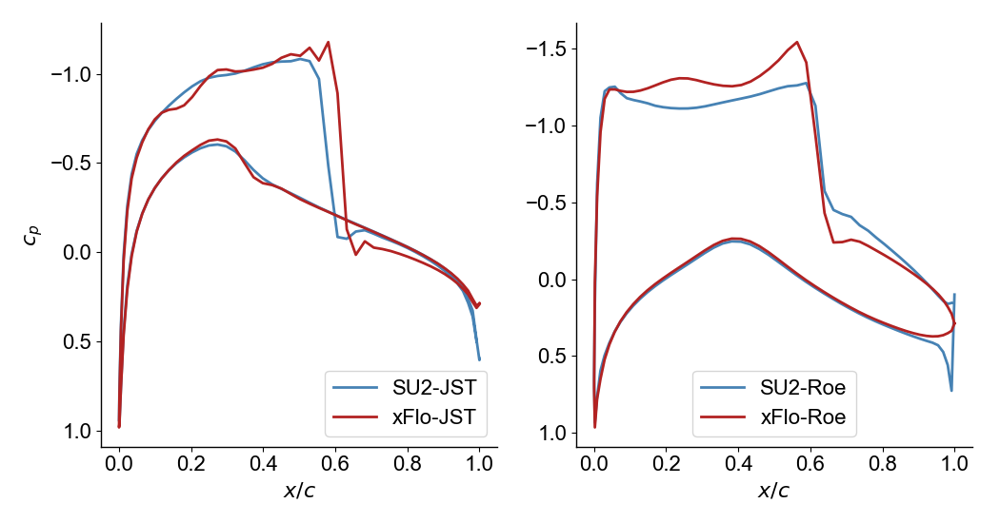

# xFlo
eXperimental Flow\
Adrien Crovato, 2025.

[](https://www.python.org/downloads/release/python-31012/)
[](https://github.com/acrovato/xflo/actions)
[](https://www.gnu.org/licenses/gpl-3.0)

## Main features
xFlo is a Python code solving the compressible Euler equations around airfoils. The code is a playground dedicated to learning computational fluid dynamics and programming techniques.

xFlo currently implements the following techniques:
- perfect gas constitutive law and Euler conservation equations;
- slip-wall and farfield (Riemann invariants) boundary conditions;
- Lax-Friedrichs, JST, Roe, HLL and HLLC convective schemes;
- explicit Runge-Kutta, explicit and implicit Euler time integration methods;
- Green-Gauss gradients reconstruction method with Venkatakrishnan limiter.

## Documentation
Get, install and test the code:
```bash
git https://github.com/acrovato/xflo.git
cd xflo
python3 -m pip install [-e] .
xflo-test
```

Run the code using:
```bash
xflo-run your_script.py
```
`xflo-run` automates the creation of a workspace directory and is not stricly necessary. `your_script.py` should contain instructions for initializing and running xFlo. This can be achieved using the [API](xflo/api.py) `init_xflo` method. Typical usage is illustrated in [tests](tests) and [examples](examples).

## Examples
Transonic flow around the RAE 2822 airfoil.\


Comparison between xFlo and SU2. Left: NACA 0012 airfoil at 1.25° angle of attack angle and Mach 0.80. Right: RAE 2822 airfoil at 2.8° angle of attack angle and Mach 0.73.\

